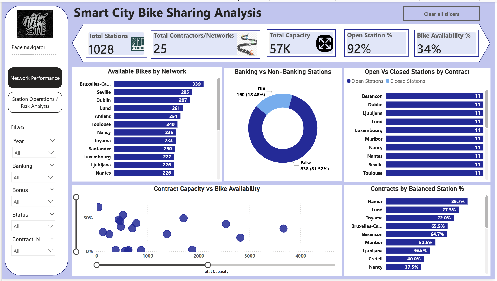
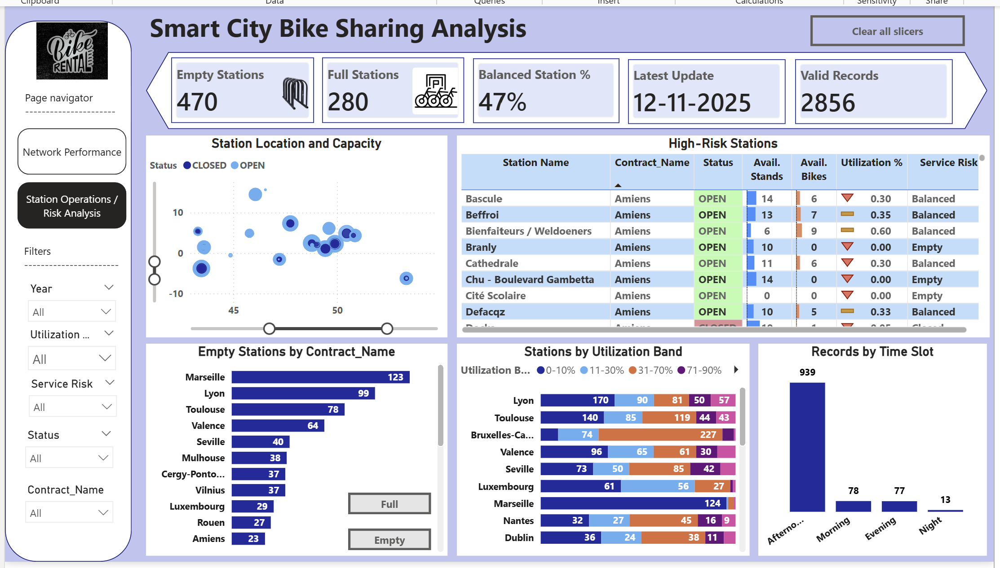

# Smart City Bike Sharing Analysis

A Power BI project analyzing bike-sharing network performance, station balance, and operational risk across multiple contracts/networks.

## Project Overview
This project evaluates the performance of a smart city bike-sharing system using operational station data. The analysis focuses on network-wide availability, station balance, empty/full station risk, and contract-level performance to support better redistribution and monitoring decisions.

## Business Objective
- Analyze overall bike-sharing network performance
- Compare station availability across contracts/networks
- Identify high-risk stations with empty, full, or closed conditions
- Evaluate operational balance using utilization patterns
- Derive insights for redistribution and service improvement

## Tools Used
- Power BI
- Power Query
- DAX
- Data Modeling (Star Schema)

## Key Metrics
- Total Stations: **1,028**
- Total Contracts/Networks: **25**
- Total Capacity: **57K**
- Open Station Rate: **92%**
- Bike Availability Rate: **34%**
- Balanced Station Rate: **47%**
- Valid Records: **2,856**

## Dashboard Pages

### 1. Network Performance

This page highlights overall network scale, bike availability, infrastructure mix, open vs closed stations, capacity vs availability, and balanced station performance.

### 2. Station Operations / Risk Analysis

This page focuses on operational risk by showing empty stations, full stations, high-risk station details, utilization bands, and time-slot distribution.

## Key Insights

### Network health
- The bike-sharing system covers **25 contracts/networks, 1,028 stations, and 57K total capacity, with an open-station rate of 92%.**
- This shows strong overall operability, so the next operational focus should shift from basic uptime to improving balance and availability across the network.

### Availability imbalance
- Despite high uptime, the **bike availability rate** is only **34%** and the **balanced station rate is 47%**, which means the network is open but not consistently balanced.
- Operations teams should prioritize redistribution in the next daily and weekly planning cycle to move more stations into the balanced range.

### Service-risk stations
- The dashboard shows **470 empty stations and 280 full stations**, which confirms that service imbalance is substantial rather than occasional.
- Rebalancing teams should reduce empty/full risk in the next operational cycle by prioritizing contracts with the highest imbalance.

### Contract-level intervention
- The risk dashboard shows especially high empty-station counts in **Marseille (123), Lyon (99), and Toulouse (78)**, while the infrastructure mix is heavily skewed toward non-banking stations at 81.52% versus 18.48% banking-enabled.
- This means operations should first target the most imbalanced contracts and review whether infrastructure upgrades are needed in high-demand locations during the next network review.

## Business Value
This dashboard helps mobility operators identify where service imbalance is highest, which contracts require stronger redistribution, and how network-wide station utilization can be improved through data-driven monitoring.

## Project Files
- Power BI dashboard file
- Analysis report
- Dataset
- Dashboard screenshots
- README

## Author
**Saranya D**  
Aspiring Data Analyst

## Tags
`Power BI` `Bike Sharing Analysis` `Mobility Analytics` `Operations Dashboard` `DAX` `Power Query` `Data Modeling` `Data Visualization` `Transport Analytics` `Portfolio Project`
